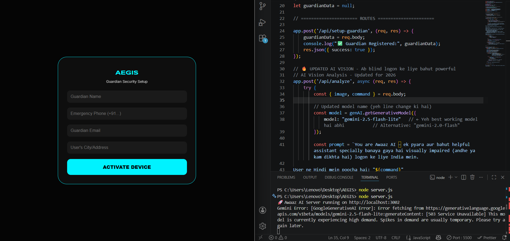
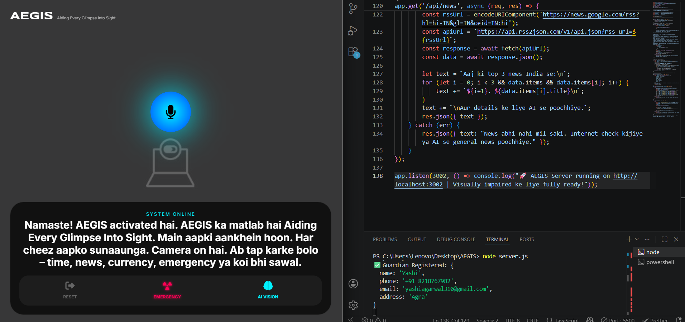
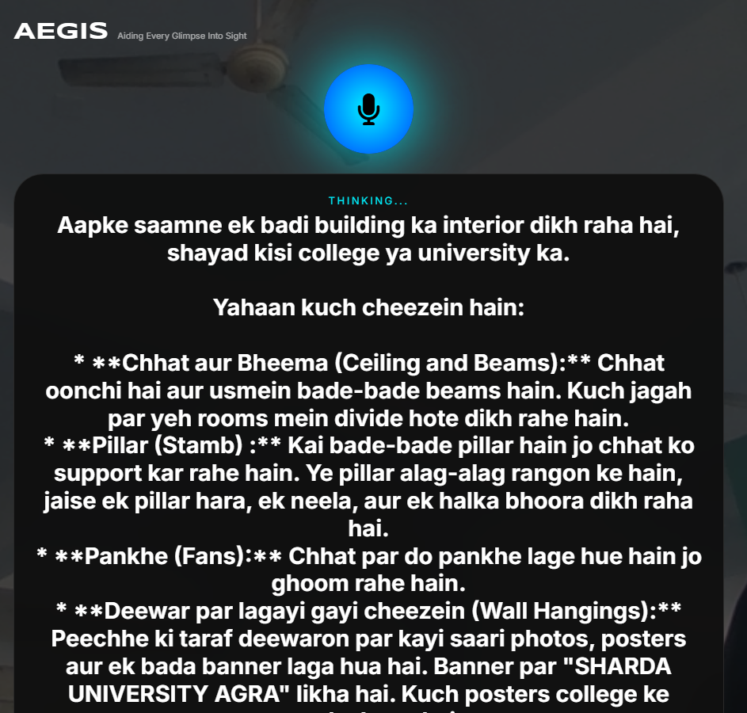

👁️ AEGIS – Aiding Every Glimpse Into Sight

🚀 AI-Powered Voice + Vision Assistant for the Visually Impaired

---

🌍 Problem Statement

Over 250 million people worldwide are visually impaired.
While they can use the internet, real-world tasks like reading medicine labels, checking expiry dates, or understanding surroundings remain difficult.

👉 They often depend on others for even simple daily activities.

---

💡 Solution

AEGIS is a voice-first AI assistant that:

- 📷 Uses the camera to “see” the environment
- 🧠 Uses AI to understand context
- 🎤 Responds with real-time audio guidance

👉 Empowering visually impaired users to be independent

---

✨ Key Features

👁️ AI Vision (Scene-to-Audio)

- Real-time scene understanding via camera
- Detects objects, medicines, expiry dates

---

🧠 General AI Mode

- Answers everyday queries like:
  - Weather
  - Time
  - News
- Example: “What’s the weather today?”

---

🚨 Emergency SOS (Important 🔥)

- Voice trigger: “Help” / “Madad”
- Detects user’s live location
- Sends SMS alert using Twilio API

👉 📲 For demo purposes, alerts are sent to a pre-configured number to simulate real-world guardian response

---

🎙️ Voice-First UI

- Tap anywhere → Speak
- Fully blind-friendly interaction

---

🧠 Unique Innovation (Winning Point 🏆)

👉 AEGIS does not just detect objects
👉 It provides intelligent decisions

Examples:

- “This medicine is expired, do not use it”
- “The path ahead is blocked”

👉 Vision + Intelligence + Safety = AEGIS

---

⚙️ Workflow (Step-by-Step)

1. User opens the app
2. Taps anywhere and gives a voice command
3. Camera captures the image
4. Backend AI analyzes image + voice input
5. Response is generated
6. Audio feedback is provided to the user

👉 In case of emergency:
7. Location is detected
8. SMS alert is sent

---

🧪 How to Test

1. First, create a Guardian account on the login screen
2. After entering, tap anywhere on the screen and start speaking

Try commands:

- “What is this?”
- “What’s the weather today?”

👉 The AI will respond with voice output

---

🚨 Emergency Test

- Say “Help” / “Madad”
  or press the Emergency button

👉 The system will:

- Detect your location
- Send an SMS alert

📩 For demo purposes, SMS is sent to a pre-configured number using Twilio integration

---

🛠️ Tech Stack

- Frontend: HTML, CSS, JavaScript
- Backend: Node.js, Express
- AI: Gemini API
- Voice: Web Speech API
- SMS: Twilio API
- Weather: Open-Meteo API

## 🖼️ Screenshots

👉 [View All Screenshots](./screenshots/)

### 🔹 Login Screen

### 🔹 Main Interface

### 🔹 Emergency Alert

### 🔹 OUTPUT

🎥 Demo Video

👉 Full working demo (recommended):
https://drive.google.com/drive/folders/1vQf9YLhCbnEVd0NhsRo6TqfDgPtSJHXn?usp=drive_link

👉 Include in video:

- Voice interaction
- AI response
- Emergency alert trigger

---

⚠️ Note (For Judges)

- The project uses real-time AI APIs, so slight delays may occur
- Demo video is provided for smooth evaluation

---

🚀 Installation

git clone https://github.com/tanuja8923/AEGIS-VISION-AI.git
cd aegis-ai
npm install
node server.js

---

👥 Team

- 👩‍💻 Tanuja Varshney
- 👩‍💻 Yashi Agarwal

---

🏆 Hackathon Impact

👉 AEGIS aims to make visually impaired individuals
more independent and confident in real-world situations

---

❤️ Final Thought

AEGIS = Aiding Every Glimpse Into Sight

👉 “Where vision fails, AI assists.”
